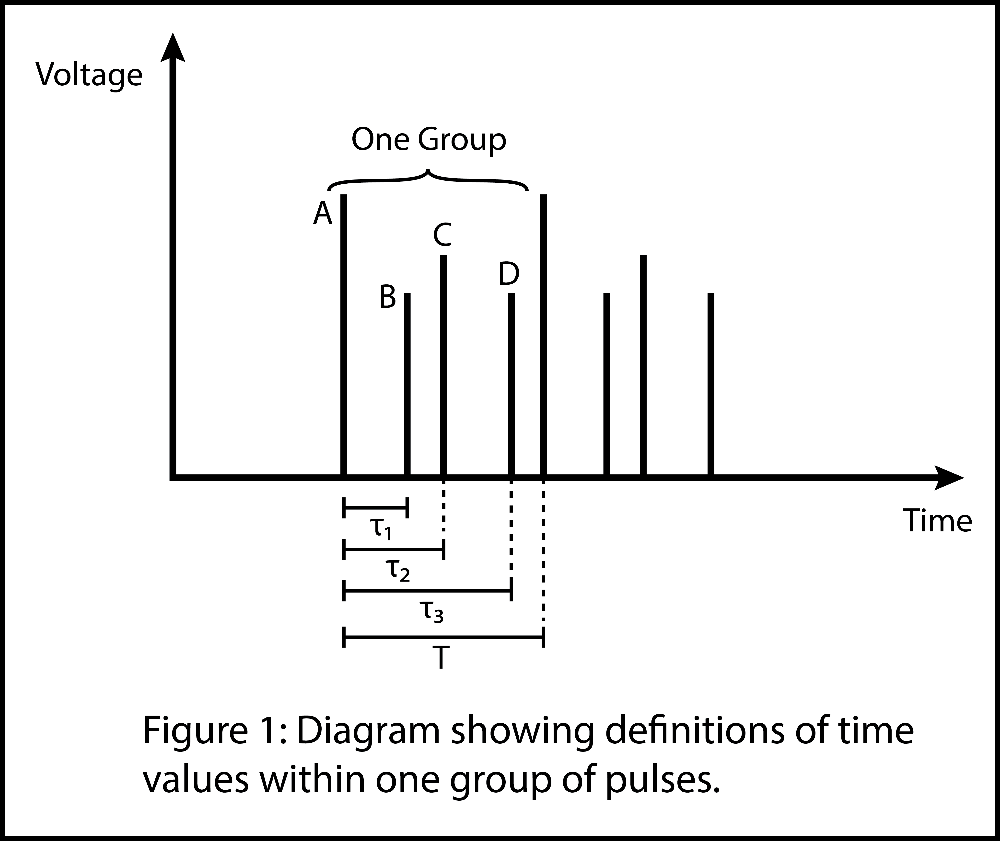

# Reflectometry Busrt Curve Fit Program

Nicolas Souleles  
Summer 2023

## Description

Program that curve-fits bursts of pulses in order to analyze pump-probe reflectometry data.

### Input

The input to this program from the command line consists of either

1. Fitting a single trace by passing a path to the trace file location (relative to the directory the python script is being run from), a time value to start fitting from, the number of pulses to fit, and the type of trace to fit (either `PUMP`, `REFLECTED`, or `TRANSMITTED`).
2. Fitting a batch of files all togeher. This requires a "manifest file" which is a .csv file containing a list of filenames in the first column, the type of trace in the second column, and (optionally) the time value to start at for each file. A batch fit can then be called from the command line by passing a path to this manifest file, a path to the location the files specified in the manifest should be found in, the number of pulses to fit, and the time value to start at for all files, if not already specified in the manifest file.

**Manifest File Definition:**

When doing a batch fit, the manifest file provided needs to have a specific form. The first column needs to consist of a list of the filenames of the traces that are to be fit. Each filename is specified relative to the `data_path` argument required by the `batch` command. The second column needs to contain strings specifying the different trace types: `PUMP`, `REFLECTED`, and `TRANSMITTED`; strings in this column must be entirely uppercase. The third optional column specifies the point in time of the peak of the first pulse the program will try to fit, for the file in the same row.

For further instructions on how to use the program from the command line, please see the "Usage" subsection below. Also be sure to use the `-h` flag on any command/subcommand for interactive help with that specific command.

### Output

This program outputs a .csv file containing the fit amplitudes for all of the input files specified. Each colum of the file will be headed by the filename of a file that was input, and the colum will consist of the amplitude parameter values for all of the pulses chosen to be fit from that file.

For example, if I fit 50 pulses from the file "C1trc00000.csv", the output will consist of a single colum, labeled "# C1trc00000.csv", and will contain 50 more rows containing the amplitudes of each of the 50 pulses that it found. If I chose to fit multiple files, there would be multiple columns each labeld with the filenames that they represent respectively.

Additionally, the python objects associated with the fit, incluting the model used, fitting parameters, all of the statistical data associated with the fit etc. can optionall be stored in a pickle file by passing the `--pickle` argument to the command before running the program. This allows the statistical data for a given fit to be loaded later and reviewed.

The output path of the .csv file and, if specified, the pickle file can be set using the `-o` flag, followed by the output path string. Currently there is no option to rename the output files. If you try to run the command using an output directory which has already been output to before, the program will prevent you from overwritting the data that's already there.

If you want to overwrite any data that's already in the output directory that you have choosen, then pass the `-f` flag.

## Goal

Reflectometry data input into the program consists of multiple data traces input as time series. These are the "pump", "reflected", and "transmitted" traces, and correspond to a burst of pulses produced by a laser which has struck a target and generated a plasma. "Pump" is a measurement of the original pump burst prdocued by the laser, and the goal is to compare the reflected and transmitted pulse amplitudes against the pump trace, in order to determine what percentage of each pulse was reflected, and what percentage emitted.

In order to do that, data series for each trace are fit to a pre-set pattern of pulses, with variable amplitude. Fit parameters for the amplitude are then compared to obtain the relevant reflectomentry measurements. Fitting the pulses requires a model function wich consists of one burst: a comb of pulses with pre-defined timing intervals between them matching that of the burst from the laser. In order to useful results, (1) the number of pulses under consideration must be known, and (2) pulses between different data traces must be matched i.e. the nth pulse of the pump trace must be compared to the pulse within the reflected and transmitted traces which resulted from that pump pulse; comparing the nth pulse from pump to the mth pulse from the reflection measurement, where m =/= n, leads to a meaningless result.

## Instructions for Running this Program

### Intstallation

In order to run this program, all requirements in `requirements.txt` must be installed. This is most easily done using pip. In the windows command shell,

```console
python -m pip install -r requirements.txt
```

On Unix/macOS,

```console
python3 -m pip install -r requirements.txt
```

Once the requirements are installed, the program can be run by running `main.py` from the command line.

Alternatively, a virtual environment can be set up, and the requirements can be installed there. To use virtual environments consult <https://docs.python.org/3/library/venv.html>.

### Usage

This program can either be used from the command line, or by calling the `fit_trace` function directly with the correct arguments.

#### Comand Line Interface

This program has a command line interface. Once the environment has been set up (see installation), the program can be calld from the command line by running

```console
python3 src/main.py [args]
```

in the root directory. Usage of the program from the command line is documented thoroughly with the help options. Simply call

```console
python3 src/main.py -h
```

to recieve a description of the program, and a list of possible commands that can be run with it. Pass the `-h` flag after any specific to recieve help for that command, including a list of what arguments to pass and in what order.

#### Batch File Example

Here is an example of the procedure of running a batch fit commnad. Say there are four traces to fit, "C1trc00000.csv", "C1trc00001.csv", "C3trc00000.csv", and "C3trc00001.csv", stored in a folder "./data/", relative to the path this program is being run from. In order to fit these traces in a batch, first create the manifest file, which should be a .csv looking something like this:

| Column 1       | Column 2     | Column 3 |
| -------------- | :----------: | -------- |
| C1trc00000.csv | PUMP         |          |
| C1trc00001.csv | PUMP         |          |
| C3trc00000.csv | REFLECTED    |          |
| C3trc00001.csv | REFLECTED    |          |

Lets store this manifest file in the root directory. Then run the command

```console
python3 src/main.py [general flags] batch [batch flags] "./" "./data" 60 -t="1e-9"
```

from the root directory (if using windows, the command may be slightly different). This will fit the first 60 pulses of all four files, with the peak of the first pulse starting at 1e-9s for all files. Flags including options to produce an output pickle file, or to change the output directory, can be supplied in the `[general flags]` field; flags specific to the `batch` subcommand are supplied in the `[batch flags]` field.

Suppose, now, one wanted to chaneg the `t0` time value depending on which file is fit. In this case one could update the maifest file including the `t0` values in the thrid column, for example

| Column 1       | Column 2     | Column 3 |
| -------------- | :----------: | -------: |
| C1trc00000.csv | PUMP         | 2e-9     |
| C1trc00001.csv | PUMP         | 1.5e-9   |
| C3trc00000.csv | REFLECTED    | 1.7e-9   |
| C3trc00001.csv | REFLECTED    | 3.1e-9   |

Now when we run the command, we can't pass the `-t` flag, since we want the program to get the `t0` value from the manifest file and not the command prompt. Addtionally, we have to tell the program to actually grab the `t0` values from the manifest file, by passing the  `-m` flag. Now the command looks like

```console
python3 src/main.py [general flags] batch [batch flags] "./" "./data" 60 -m
```

If the data one wants to fit is stored across multiple folders, one could either

1. Specify only the common folder in the `data_path` argument, and specify each subfolder in the filenames contained in the manifest file, or
2. Create a different manifest file for each subfolder, and run two different commands.

## Operation of the Algorithm

### Fitting the Pump Burst

Defining the function used to fit the burst requires a model of each pulse. Pulses are modeled by a function consisting of a Gaussian, with an exponential tail. This fit function was determined by Anna Hwang, and the optimal fixed parameters for the pulse shape were obtained from her work performed in 2019 (there is one difference, being that her function also used two vertical offset parameters; these are not used here, and set to zero in the code). The function thus takes the form:

$$f(t) =
\begin{cases}
a_1\exp\left(-\frac{t^2}{2c^2}\right) \text{ if } t \leq \Delta t\\
a_2\exp(-\lambda (t - \Delta t)) \text{ if } t > \Delta t
\end{cases}
$$

where $\Delta t$ is the distance between the peak of the gaussian and the beginning of the exponential tail, and

$$a_2 = a_1\exp\left(-\frac{\Delta t^2}{2c^2}\right)$$

in order that the function be continuous. Requiring the pulse to be differentiable results in the $\Delta t$ value being determined as follows

$$\Delta t = \lambda \sigma^2$$

Values for $a_1, c,$ and $\lambda$ are pre-determined and not part of fitting the burst.

With the pulse shape defined, the burst can be constructed as a sum of pulses. The comb of pulses used to fit burst must be a monolithic, having pre-set timing between pulses (i.e. the timing between pulses cannot change as a parameter of the fit). In order to define such a function, the timing between pulses must be written as a function of the pulse number.

<p align="center">
    
</p>

As pulses recur periodically in groups of four, using notation from Figure 1, the timing can be specified by the following modular function:

$$\phi_n =
\begin{cases}
0 \text{ if } n \equiv 0 (\text{mod } 4)\\
\tau_1 \text{ if } n \equiv 1 (\text{mod } 4)\\
\tau_2 \text{ if } n \equiv 2 (\text{mod } 4)\\
\tau_3 \text{ if } n \equiv 3 (\text{mod } 4)
\end{cases}
$$

Therefore, the overall burst shape function is given by

$$g(t) = \sum_{n=0}^{N - 1} A_n f\left(t - t_0 - T\left\lfloor\frac{n}{4}\right\rfloor - \phi_n\right)$$

Where $N$ is the number of pulses to be fit, and $t_0$ is the user-defined starting time for the burst; $t_0$ is not a fitting parameter.

### Curve Fitting

All curve fits involve fitting the function $g(t)$ defined above, to a time series, by varying the parameters $A_0, \dots, A_{N - 1}$.

As can be observed, the model $g(t)$ is linear in the amplitude parameters $A_n$. Therefore, ordinary least squares fitting is used to obtain the fit. To do this, the regresor matrix is obtained by setting

$$x_{ij} = f\left(t_i - t_0 - T\left\lfloor \frac j 4 \right \rfloor- \phi(j)\right)$$

as the $ij^{\text{th}}$ regressor. The OLS estimator is then obtained using the `statsmodels.api.OLS` class from the `statsmodels` module. Results are saved internally in the program using the output object by calling the `.fit()` method on this class, and that is what is saved in the pickle file when the flag is set from the command line. See the documentation of the `statsmodels` module for more details.

### Determining Fit Quality

This program uses the $R^2$ value as a measure of the quality of fit. In particular, if $(t_i, y_i)$ are $n$ data points, fit to the function $g(t)$, then the values

$$SS_{res} = \sum_{i=1}^n (y_i - g(t_i))^2$$

$$SS_{tot} = \sum_{i=1}^n (y_i - \bar{y})^2$$

are computed, in order to obtain

$$R^2 = 1 - \frac{SS_{res}}{SS_{tot}}$$

This is done by `statsmodels` automatically, and so is not implemented directly in this program.

Additionally, plots are produced to indicate the fit quality. When plots are enabled by the `-p` flag, the program outputs a figure containing

1. A plot of the fit against the data it was fit to
2. A plot of residuals, and
3. A normal q-q plot, to evaluate the spread of residuals compared to a normal distribution.

These plots can be generated any time a previously generated pickle file is loaded into the program, by passing the `-p` flag with the `load_pickle` command.
